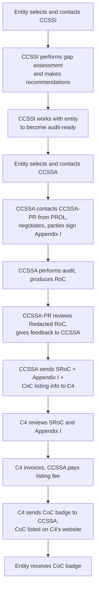
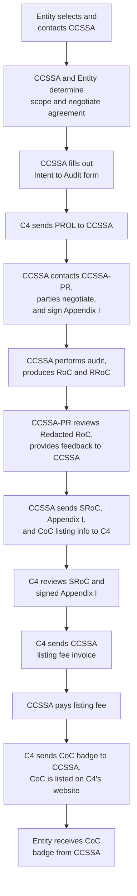

# CCSS certification process, roles, and audit documents

Everything about *how* a CCSS audit runs — who is involved, what documents exist, what the peer review requires, and what the independence rules are.

## Contents

- [CCSS certification process, roles, and audit documents](#ccss-certification-process-roles-and-audit-documents)
  - [Contents](#contents)
  - [Roles and acronyms](#roles-and-acronyms)
  - [What gets certified](#what-gets-certified)
  - [End-to-end certification flow](#end-to-end-certification-flow)
  - [Pre-audit stage](#pre-audit-stage)
  - [Audit stage](#audit-stage)
  - [Peer review rules](#peer-review-rules)
  - [Post-audit stage](#post-audit-stage)
  - [Audit documents](#audit-documents)
  - [Audit finding statuses](#audit-finding-statuses)
  - [Evidence gathering and IPE](#evidence-gathering-and-ipe)
  - [The CCSS Trusted Environment](#the-ccss-trusted-environment)
  - [Auditor and implementer certification](#auditor-and-implementer-certification)
  - [Independence and conflict of interest](#independence-and-conflict-of-interest)
  - [Official resources](#official-resources)

## Roles and acronyms

| Short name | Meaning |
| --- | --- |
| **C4** | CryptoCurrency Certification Consortium — publishes CCSS, issues the CoC, maintains the public listings |
| **CCSSI** | CCSS Implementer — consultant who prepares an entity for audit |
| **CCSSA** | CCSS Auditor — performs the audit and writes the RoC |
| **CCSSA-PR** | CCSS Auditor Peer Reviewer — independent CCSSA who reviews the redacted RoC |
| **PROL** | Peer Reviewer Options List — randomised list of eligible CCSSA-PRs supplied by C4 |
| **RoC** | Report on Compliance |
| **RRoC** | Redacted Report on Compliance |
| **SRoC** | Summary Report on Compliance |
| **CoC** | Certificate of Compliance |
| **QSP** | Qualified Service Provider |

**CCSSI vs CCSSA.** The implementer builds and documents the controls; the auditor independently tests them. They must not be the same person for the same system — an auditor reviewing their own implementation work has an obvious bias.

## What gets certified

**Systems are certified, not entities.** One entity can hold several certifications. For example Fireblocks has four certified systems: Hot and Cold Vaults, Secure Transfer Environment, Authorization Workflow, and Tokenization Engine.

Three certifiable system types:

| Type | Definition | Example |
| --- | --- | --- |
| **Self-Custody** | Holds all keys controlling the entity's *own* funds. No control over customer funds. | A Web3 marketing firm that accepts crypto and controls its own treasury keys. |
| **Qualified Service Provider (QSP)** | Facilitates a *subset* of custody services to other systems, so it only needs to meet certain requirements. A consumer system that uses a QSP has fewer remaining requirements to certify. | An HSM or MPC service providing key management to another entity's system. |
| **Full System** | Meets all applicable CCSS requirements in totality. May rely on a certified QSP for some requirements, as determined by the CCSSA. | An exchange that reaches quorum without any additional system, or one that incorporates a QSP. |

Certified systems are listed publicly at <https://cryptoconsortium.org/completed-ccss-audits/>.

## End-to-end certification flow

## Pre-audit stage

1. Entity selects and contacts a CCSSI to develop and implement the measures needed to reach a target level.
2. CCSSI performs an audit readiness (GAP) assessment.
3. CCSSI works with the entity to close the gaps.

This stage is optional in the sense that a CCSSA may also run a readiness assessment, but doing it up front lets the CCSSA scope the real audit accurately and avoid surprises mid-engagement.

## Audit stage

The audit stage in detail:

1. Entity selects and contacts a CCSSA.
2. Recommended: readiness assessment, if the CCSSI did not already do one.
3. Entity and CCSSA scope the system by determining the boundaries of the **CCSS Trusted Environment**, and negotiate an agreement.
4. CCSSA completes the [Intent to Audit form](https://cryptoconsortium.org/intent-to-audit/).
5. C4 responds with a randomised **PROL** of eligible CCSSA-PRs.
6. CCSSA contacts one of the CCSSA-PRs, negotiates the peer review cost, and has **Appendix I** signed.
7. CCSSA applies evidence-gathering techniques against every applicable requirement.
8. CCSSA builds the **RoC** using the official C4 template — local copies: [markdown](audit-documents/CSSAA%20Auditor%20Course-%20RoC_9_CCSS_Report-on-Compliance_Template%20%28required%29.md) (for reading/reference) and [.docx](audit-documents/CSSAA%20Auditor%20Course-%20RoC_9_CCSS_Report-on-Compliance_Template%20%28required%29.docx) (the working file the CCSSA fills in).
9. CCSSA produces the **RRoC** from the RoC. Recommended: get the entity's approval of the RRoC before releasing it, to confirm no sensitive data or PII survived redaction. Both CCSSA and CCSSA-PR must treat the RRoC as confidential, and the CCSSA never shares the underlying evidence with the CCSSA-PR.
10. **Peer review** (see below).
11. After peer review, the CCSSA emails `CCSS_Submissions@cryptoconsortium.org`, cc'ing the CCSSA-PR, with:
    - Summary Report on Compliance (SRoC) in PDF, built from the official C4 SRoC template ([.docx](audit-documents/CCSS-Summary-Report-on-Compliance-CCSS-V9.0%20-%20for%20CCSSA%20Training%20Program.docx))
    - Appendix I (CCSS Auditor Independence and Liability Acknowledgment)
    - Entity's CoC listing information (entity website, contact, system audited, logo as .jpg or .png, at least 500×500 px)
    - Listing fee total cost
12. C4 invoices the CCSSA for the listing fee. Once paid, C4 issues the CoC and badge to the CCSSA, who passes it to the entity.

C4 will not view evidence documentation outside the SRoC. The CCSS Steering Committee reviews evidentiary documentation only in the case of a peer review dispute, and arbitrates any dispute arising out of peer review.

## Peer review rules

Every CCSS audit is peer reviewed after the CCSSA finishes evidence gathering and documentation. The point is not to re-audit the entity — the CCSSA-PR has no agreement with the entity and cannot see the evidence. The point is to check that the CCSSA **gathered a broad enough range of evidence** (interviews, inspection, observation, review) to legitimately form the opinion they formed.

Hard rules:

- The CCSSA-PR reviews the **RRoC only**, never the raw evidence.
- The CCSSA-PR communicates **only with the CCSSA** — no contact with the audited entity.
- A CCSSA-PR cannot peer review the same entity again for **three years** after their initial peer review of that entity.
- If a CCSSA audited a system, they cannot peer review the **next three audits** of that system.
- A CCSSA-PR employed by or contracted with the **same organization** as the CCSSA cannot perform the review.
- Enforcing these rules is the responsibility of the CCSSA conducting the audit.
- The CCSSA-PR must give the CCSSA **written confirmation** that peer review is complete and no further remediation is required.
- All CCSSAs must make themselves available to perform one peer review for every audit they complete.

Typical effort and timing:

- Peer review effort: **10–15 hours**, varying with the system(s) audited.
- Add **1–2 hours** for re-review of changed RRoC sections if the CCSSA-PR requires changes.
- Recommended timeframe: **10 working days** for the review, **10 working days** for resolution of queries.
- For a CCSSA's first peer review, the reviewer is typically a CCSS Steering Committee member.

## Post-audit stage

The audit is repeated after 12 months if the entity wants the certification to stay active and listed. Audits are designed to be performed at least annually and cover the **preceding 12-month period** — they test operating effectiveness over that window, not just a point-in-time snapshot.

## Audit documents

**Readiness (GAP) assessment.** Determines whether the information system — people, processes, and technology — is ready for a CCSS audit. Output is a gap report listing missing components and suggested remediation. It lets the CCSSA estimate the real audit timeline accurately.

**Report on Compliance (RoC).** The main deliverable. Contains all gathered and reviewed evidence plus the CCSSA's rationale for each determination. Must use the official C4 RoC template ([markdown](audit-documents/CSSAA%20Auditor%20Course-%20RoC_9_CCSS_Report-on-Compliance_Template%20%28required%29.md), [.docx](audit-documents/CSSAA%20Auditor%20Course-%20RoC_9_CCSS_Report-on-Compliance_Template%20%28required%29.docx)). Covers the twelve months preceding the audit start date.

**Redacted RoC (RRoC).** A copy of the RoC with all sensitive information and PII of the entity, the audited systems, and interviewed personnel removed. Produced solely for the peer review.

**Summary Report on Compliance (SRoC).** Official C4 document completed at the end of the audit, created only once the RRoC passes peer review. Like the RoC, it must use the official C4 template — local working copy: [.docx](audit-documents/CCSS-Summary-Report-on-Compliance-CCSS-V9.0%20-%20for%20CCSSA%20Training%20Program.docx). Sent to `CCSS_Submissions@cryptoconsortium.org` cc'ing the CCSSA-PR. Contains no PII or sensitive information about the audited systems.

**Certificate of Compliance (CoC).** Issued by C4 once the audit passes and the listing fee is paid. C4 provides the CoC and badge to the CCSSA, who provides it to the entity.

**Appendix I.** CCSS Auditor Independence and Liability Acknowledgment. Must be signed by the CCSSA, the CCSSA-PR, and the entity for the audit to be recognised by C4, and must be submitted with the SRoC.

**Evidence retention.** The CCSSA is responsible for ensuring all audit data is transmitted and stored securely for the duration of the CoC and as legally required in the audit's jurisdiction, and for meeting data protection requirements (GDPR or equivalent) for that jurisdiction. The RoC records whether evidence is held by the CCSSA or by the audited organization.

## Audit finding statuses

Each requirement in the RoC gets exactly one of these statuses.

| Finding status | Definition |
| --- | --- |
| **In-Place** | All parts of the demonstrated process were shown to meet the requirement as written in the CCSS. |
| **In-Place with Comparable Control** | A control put in place by the entity that provides equivalent or comparable protection to the control defined in the CCSS. |
| **Qualified for In-Place** | All parts of the demonstrated process that are within a system's control were shown to meet the requirement as written, however there are elements that lay beyond the audited system's control. This qualifies the process to be found "in-place" when implemented by a consumer system that makes use of the audited system as a service provider. |
| **Not In-Place** | One or more parts of the demonstrated processes did not meet the requirement as written and no comparable control was provided. |
| **Not Applicable** | The requirement does not apply to the assessed entity's environment, and the CCSSA has evidenced that the entity's environment does not support or provide a facility that would meet the requirement's intent. |

"Qualified for In-Place" is the status that makes the QSP model work: a service provider can satisfy the part of a requirement it controls, and its consumer systems complete the rest.

Marking something **Not Applicable** is not a free pass — the CCSSA must provide evidence that testing was undertaken to confirm the environment genuinely does not support or provide a facility meeting the requirement's intent.

## Evidence gathering and IPE

The five evidence types recorded per requirement in the RoC:

- **Interviews** — with personnel in the relevant roles
- **Observations** — watching a process being performed
- **Documents** — reviewing policies, standards, procedures, runbooks
- **Inspections** — examining system configurations and artifacts
- **CCSS Committee Decisions** — where a Steering Committee ruling applies

**Information Provided by the Entity (IPE)** — records the CCSSA maintains to support their conclusions on requirement effectiveness and CCSS level obtained:

- Procedures performed to reach the conclusion (review, inspection, observation, interview, reperformance).
- Evidence of procedures performed over IPE to demonstrate completeness and accuracy.
- Rationale and methodology used when applying sampling over a population of items.
- Rationale for the conclusion reached on the CCSS level of compliance.

IPE is covered extensively in sections 1.2.2, 1.2.3 and 1.2.4 of the [Auditor Guide](audit-documents/Auditor-Guide-2025.md).

## The CCSS Trusted Environment

Definition: the physical location, hardware, and software used in private key-related operations — plus the people and processes around them.

- **The audited entity defines** the CCSS Trusted Environment.
- **The CCSSA verifies its accuracy**, ensuring all people, processes and technology components that are key management systems — *and any other components that could impact the security of the key management systems* — are inside the audit scope.
- Failing to scope before the audit pushes scoping work into the audit itself, costing extra effort, time and money.
- The RoC requires the CCSSA to name themselves as confirming the Trusted Environment was accurately identified and validated, and to document any validated components deliberately excluded from the audit, with reasons.

The [CCSS Audit Methodology Handbook](audit-documents/CCSS-Audit-Methodology-Handbook.md) contains an extensive guide to scoping the Trusted Environment.

## Auditor and implementer certification

Both tracks require C4's official **CCSS Foundations** course plus the track-specific training, and a passing exam grade.

**Exam format** (both tracks): 100 multiple-choice and true/false questions covering each of the 41 aspect controls, 90 minutes, **70% to pass**, one free retake, then paid attempts. Candidates have 6 months from purchase to sit the exam. Questions are tied to a published real-world scenario, e.g.:

- CCSSI Scenario M: [local markdown](exam-scenarios/CCSSI-v9.0-Scenario-M.md) (source: <https://cryptoconsortium.org/wp-content/uploads/2026/02/CCSSI-v9.0-Scenario-M.pdf>)
- CCSSA Scenario E: [local markdown](exam-scenarios/CCSSA-v9.0-Exam-Scenario-E.md) (source: <https://cryptoconsortium.org/wp-content/uploads/2025/08/CCSSA-v9.0-Exam-Scenario-E.pdf>)
- CCSSA Scenario F: [local markdown](exam-scenarios/CCSSA-v9.0-Exam-Scenario-F.md) (source: <https://cryptoconsortium.org/wp-content/uploads/2025/08/CCSSA-v9.0-Exam-Scenario-F.pdf>)

**Renewal.** Both CCSSI and CCSSA certifications renew **annually**, to demonstrate understanding of the current version of the standard. Renewal requires passing the most current exam; depending on what changed, a short update module may suffice.

C4 does not endorse specific CCSSIs or CCSSAs. Public listings:

- Certified auditors: <https://cryptoconsortium.org/auditors-table/>
- Certified implementers: <https://cryptoconsortium.org/certified-implementers/>

## Independence and conflict of interest

Both CCSSIs and CCSSAs must avoid any potential conflict of interest, including current or previous employment, familial relationships, financial interest (tokens or equity held), or anything else that could constitute one.

The CCSSA must not be the same individual who acted as CCSSI for that system — auditors do not audit their own work. This is a standard professional-auditing ethical principle to eliminate bias in findings.

Agreements:

- All CCSS audit agreements are written between the CCSSA and the entity and must include the audit scope.
- The CCSSA is responsible for ensuring every agreement includes a confidentiality clause compliant with the audit's jurisdiction.
- Where the CCSSA represents a company, that must be reflected in the agreement (e.g. "<auditor name> representing <company>"). Formalising auditors as employees matters for insurance and liability, so they are not exposed as solo practitioners.
- Appendix I must be signed by CCSSA, CCSSA-PR, and entity: <https://cfour.wpenginepowered.com/wp-content/uploads/2022/07/Appendix-1.1.1-2022-7-22.pdf>

## Official resources

- CCSS v9.0 table: <https://cryptoconsortium.org/ccss-table-v9/>
- CCSSA glossary: <https://cryptoconsortium.org/cryptocurrency-security-standard-auditor-ccssa-glossary/>
- CCSS Audit Methodology Handbook: `references/audit-documents/CCSS-Audit-Methodology-Handbook.md` (local copy; source: <https://cryptoconsortium.org/wp-content/uploads/2024/09/CCSS-Audit-Methodology-Handbook.pdf>)
- C4 official RoC template v1.3: `references/audit-documents/CSSAA Auditor Course- RoC_9_CCSS_Report-on-Compliance_Template (required).docx` (auditor working copy) and the `.md` conversion alongside it (AI-friendly reading copy). Always check the CCSSA Resources Portal for a newer template version before starting an audit.
- CCSSA Auditor Guide (v2.0, 2025-07-18) — audit process, IPE, sampling, peer review, professional ethics, audit flow: [local markdown](audit-documents/Auditor-Guide-2025.md) (converted from the PDF alongside it; landing page: <https://cryptoconsortium.org/cryptocurrency-security-standard-auditor-ccssa-guide/>). Note: Table 1, the listing fee table, is an image in the PDF and is absent from the markdown — see `references/engagement-and-fees.md` for the fee figures.
- C4 official SRoC template (CCSS v9.0): `references/audit-documents/CCSS-Summary-Report-on-Compliance-CCSS-V9.0 - for CCSSA Training Program.docx` The mandatory template for the SRoC the CCSSA submits to C4. Like the RoC template, it is official C4 documentation and must not be altered — wording, formatting or branding changes need written approval from the CCSS Steering Committee.
- Intent to Audit form: <https://cryptoconsortium.org/intent-to-audit/>
- CCSS v9 Testing Procedures — the per-requirement Review/Inspect/Observe/Interview procedures: [local markdown](audit-documents/CCSS%20v9%20Testing%20Procedures%20for%20Course.md) (converted from the course PDF alongside it; source spreadsheet: <https://docs.google.com/spreadsheets/d/1fBt1puBpR896o8n0QupVjRPi15P4YtPV1jza8p1wDC8/edit>)
- CCSSA resources: <https://cryptoconsortium.org/ccssa-resources/>
- Certified systems list: <https://cryptoconsortium.org/completed-ccss-audits/>
- CCSS training (CCSSI and CCSSA tracks): <https://cryptoconsortium.org/product/ccss-training/>
